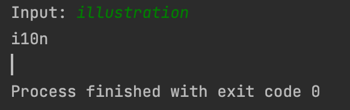

# Quiz 1
```.py
input = input("Input: ")
words = input.split(' ')
x = 0
while x < len(words):
   if len(words[x]) > 2:
       print(words[x][0] + str(len(words[x])-2) + words[x][-1])
       x = x + 1
   else:
       print(words[x])
       x = x + 1


```



Fig.1 is solution to the quiz
In Fig.1 I solved the quiz by creating the steps for the blackbox and I also created my own blackbox.
