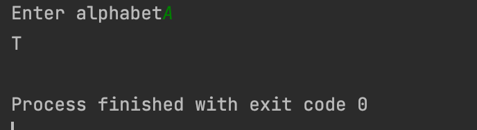

```.py

alphabet = str(input("Enter alphabet"))

if alphabet == "A":
    print("T")

if alphabet == "G":
    print("C")

if alphabet == "T":
    print("A")

if alphabet == "C":
    print("G")

```




