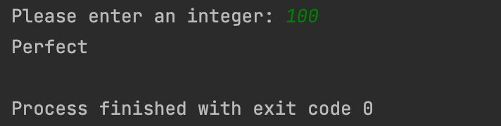
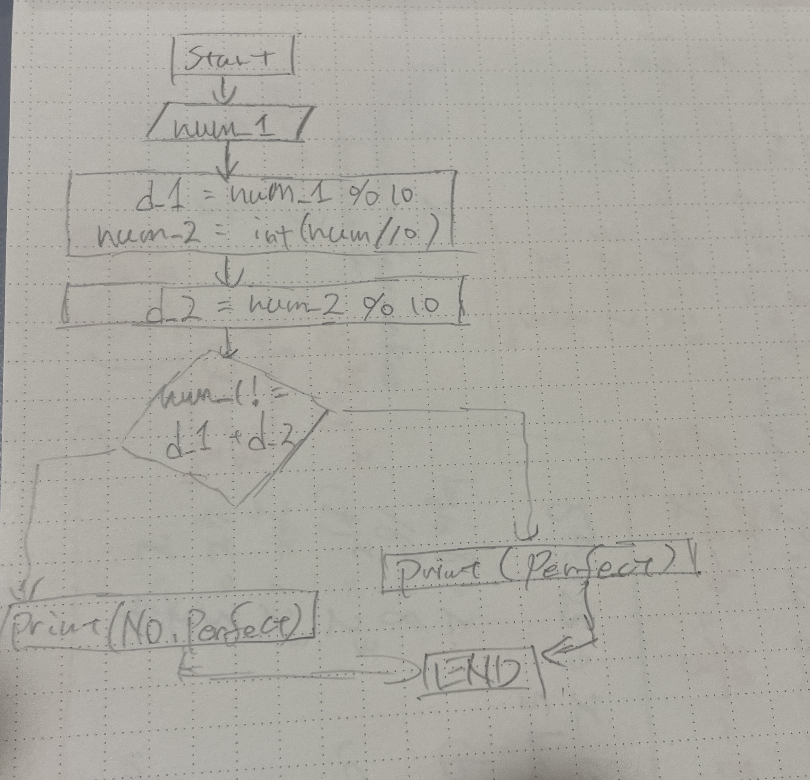

```.py

num_1 = int(input("Please enter an integer: "))

d_1 = num_1 % 10
num_2 = int(num_1 / 10)
d_2 = num_2 % 10

if num_1 != d_1 + d_2:
    print("Perfect")
else:
    print("Not perfect")
    
```




