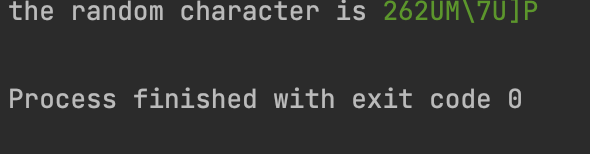
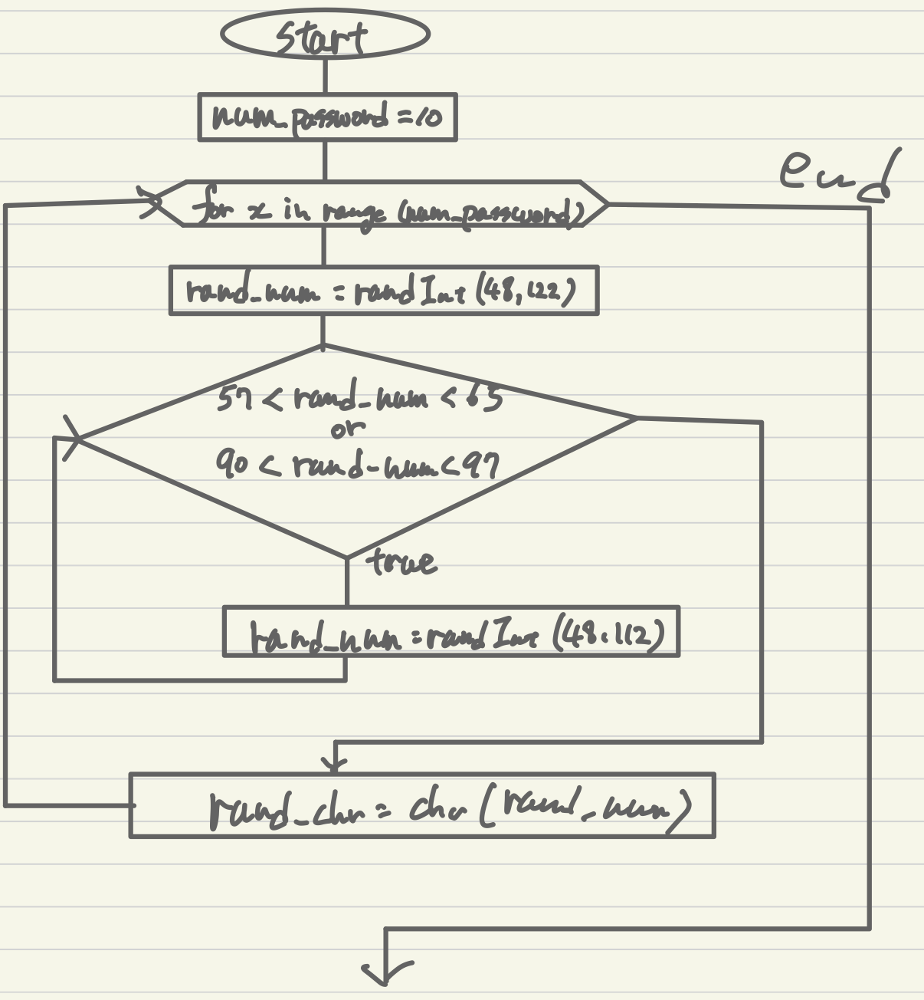

```.py

import random
end_code = "\033[00m"
green = "\033[;32m"

num = random .randint(0, 50)
rand_chr = ''

for x in range(10):
    rand_num = random.randint(48,122)
    while 57 < rand_num < 65 or 90 < rand_num > 97:
        rand_num = random.randint(48,122)
    rand_chr += chr(rand_num)


print(f"the random character is {green}{rand_chr}{end_code}")


````




