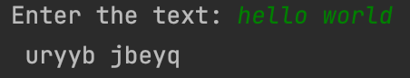
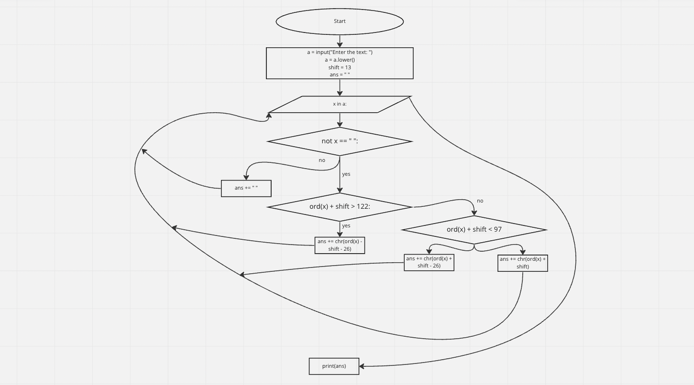

```.py
a = input("Enter the text: ")
a = a.lower()
shift = 13
ans = " "

for x in a:
    if not x == " ":
        if ord(x) + shift > 122:
            ans += chr(ord(x) + shift - 26)
        elif ord(x) + shift < 97:
            ans += chr(ord(x) + shift + 26)
        else:
            ans += chr(ord(x) + shift)
    else:
        ans += " "
print(ans)
```




