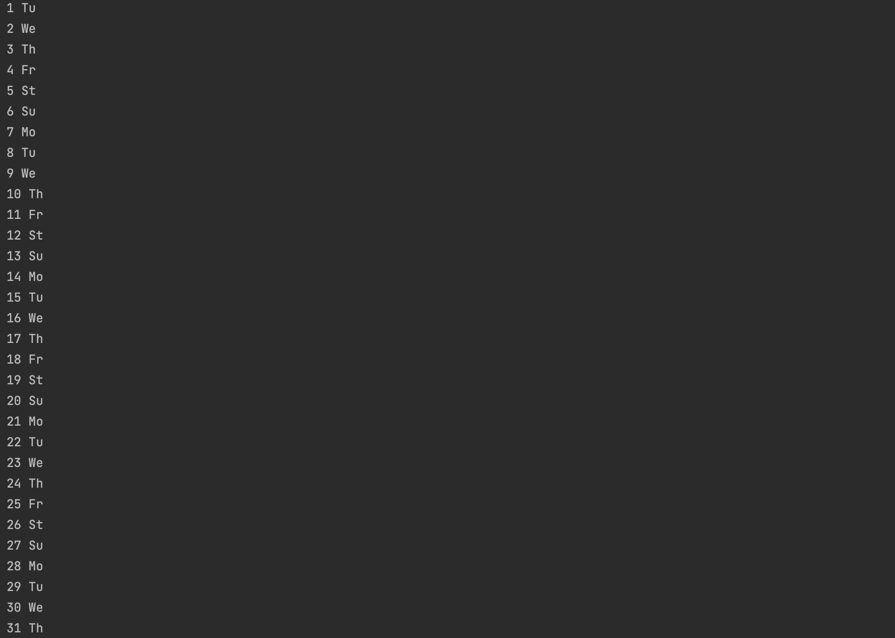
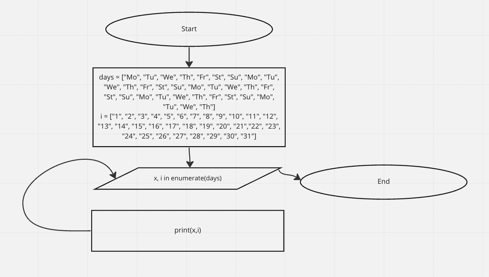

```.md
days = ["Mo", "Tu", "We", "Th", "Fr", "St", "Su", "Mo", "Tu", "We", "Th", "Fr", "St", "Su", "Mo", "Tu", "We", "Th", "Fr", "St", "Su", "Mo", "Tu", "We", "Th", "Fr", "St", "Su", "Mo", "Tu", "We", "Th"]
i = ["1", "2", "3", "4", "5", "6", "7", "8", "9", "10", "11", "12", "13", "14", "15", "16", "17", "18", "19", "20", "21","22", "23", "24", "25", "26", "27", "28", "29", "30", "31"]


for x, i in enumerate(days):
    print(x,i)
```


