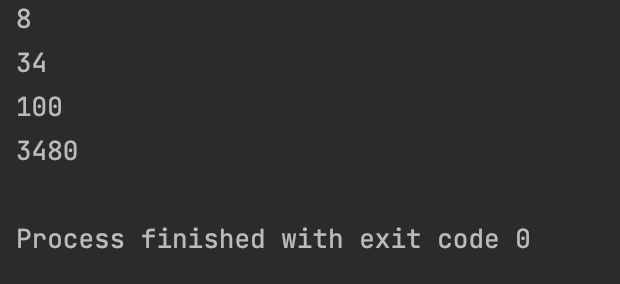
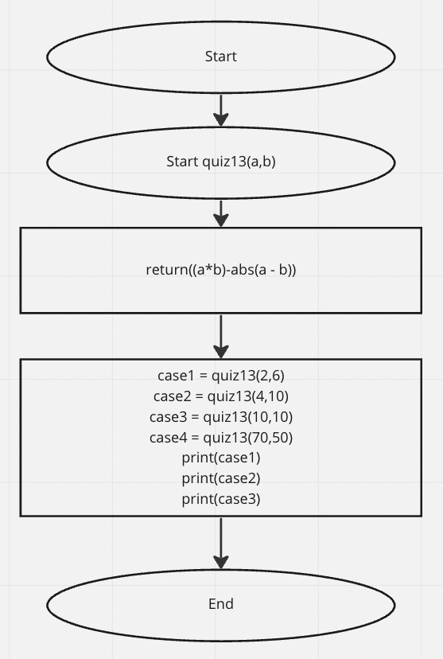

```,py
def quiz13(a,b):
    return((a*b)-abs(a - b))

case1 = quiz13(2,6)
case2 = quiz13(4,10)
case3 = quiz13(10,10)
case4 = quiz13(70,50)
print(case1)
print(case2)
print(case3)
print(case4)
```



