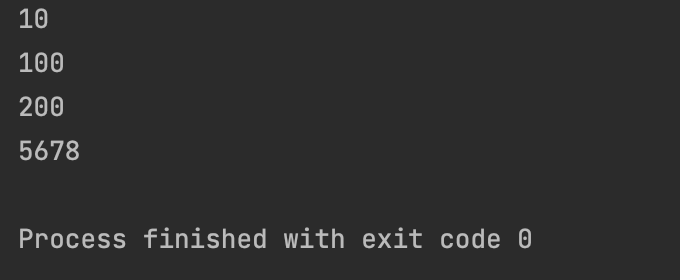
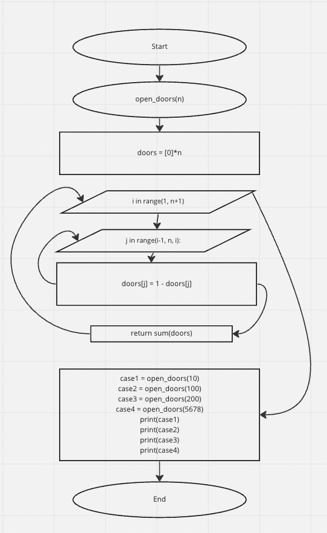

```.py
def open_doors(n):

    doors = [0]*n
    for i in range(1, n+1):
        for j in range(i-1, n, i):
            doors[j] = 1 - doors[j]
        return sum(doors)


case1 = open_doors(10)
case2 = open_doors(100)
case3 = open_doors(200)
case4 = open_doors(5678)
print(case1)
print(case2)
print(case3)
print(case4)
```



