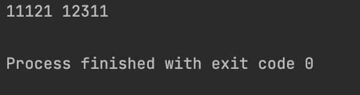
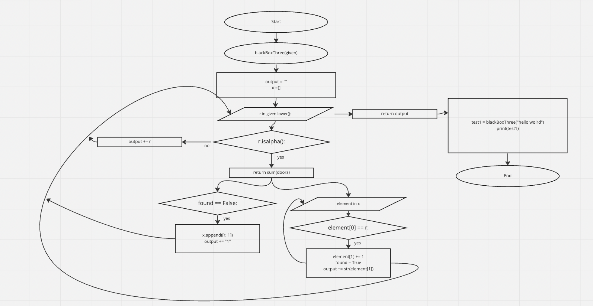

```.py
def blackBoxThree(given):
    output = ""

    x =[]
    for r in given.lower():
        if r.isalpha():
            found = False
            for element in x:
                if element[0] == r:
                    element[1] += 1
                    found = True
                    output += str(element[1])
            if found == False:
                x.append([r, 1])
                output += "1"
        else:
            output += r
    return output

test1  = blackBoxThree("hello wolrd")
print(test1)
```



