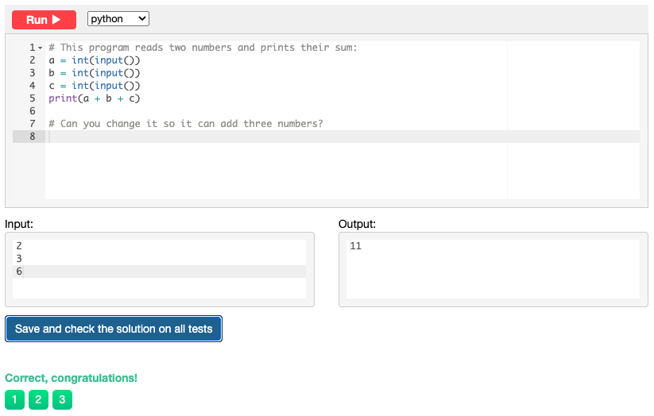

# Snakify
## Chapter 1: Input, print and numbers

### Sum of three numbers
```.py
a = int(input())
b = int(input())
c = int(input())
print(a + b + c)
```


### Hi John
```.py
name = input()
print('Hi', name)
```


### Square
```.py
num = int(input())
print(num ** 2)
```


### Area of right-angled triangle
```.py
length = int(input())
height = int(input())

print(float(length*height/2))
```


### Hello, Harry!
```.py
name = input()

print('Hello, ' + name + '!' )
```


### Apple sharing
```.py
n = int(input())
k = int(input())

print(k // n)
print(k % n)
```


### Previous and next
```.py
a = int(input())

b = str(a + 1)
c = str(a - 1)

print('The next number for the number ' + str(a) + ' is ' + str(b) + '.')
print('The previous number for the number ' + str(a) + ' is ' + str(c) + '.')
```


### Two timestamps
```.py
a1 = int(input())
a2 = int(input())
a3 = int(input())
b1 = int(input())
b2 = int(input())
b3 = int(input())

print(b1*3600 + b2*60 + b3 - a1*3600 - a2*60 - a3)
```


### School desks
```.py
class_a = int(input())
class_b = int(input())
class_c = int(input())

print(class_a // 2 + class_a % 2 + class_b // 2 + class_b % 2 + class_c // 2 + class_c % 2)
```


