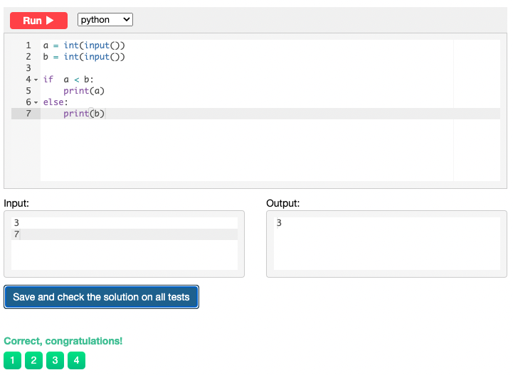
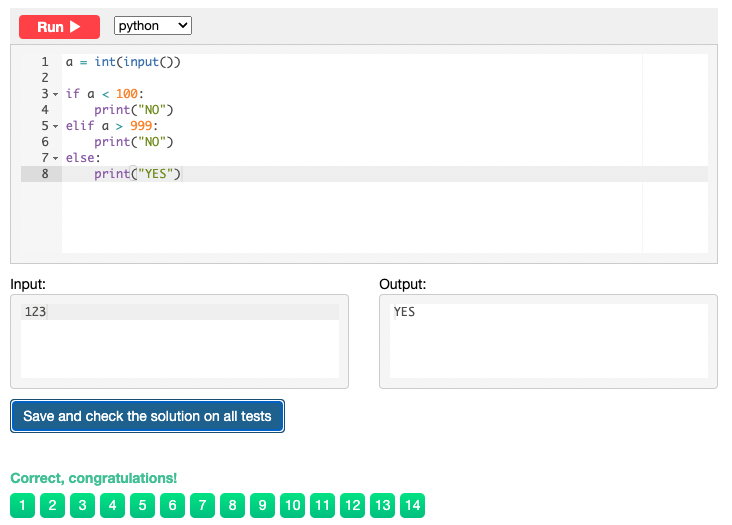
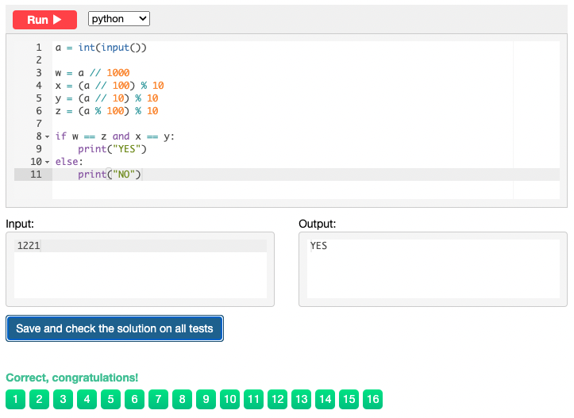

# Snakify
## Chapter 1: Input, print and numbers

### Sum of three numbers
```.py
a = int(input())
b = int(input())
c = int(input())
print(a + b + c)
```


### Hi John
```.py
name = input()
print('Hi', name)
```


### Square
```.py
num = int(input())
print(num ** 2)
```


### Area of right-angled triangle
```.py
length = int(input())
height = int(input())

print(float(length*height/2))
```


### Hello, Harry!
```.py
name = input()

print('Hello, ' + name + '!' )
```


### Apple sharing
```.py
n = int(input())
k = int(input())

print(k // n)
print(k % n)
```


### Previous and next
```.py
a = int(input())

b = str(a + 1)
c = str(a - 1)

print('The next number for the number ' + str(a) + ' is ' + str(b) + '.')
print('The previous number for the number ' + str(a) + ' is ' + str(c) + '.')
```


### Two timestamps
```.py
a1 = int(input())
a2 = int(input())
a3 = int(input())
b1 = int(input())
b2 = int(input())
b3 = int(input())

print(b1*3600 + b2*60 + b3 - a1*3600 - a2*60 - a3)
```


### School desks
```.py
class_a = int(input())
class_b = int(input())
class_c = int(input())

print(class_a // 2 + class_a % 2 + class_b // 2 + class_b % 2 + class_c // 2 + class_c % 2)
```


## Chapter 2: Integer and float numbers

### Last digit of integer
```.py
a = int(input())

print(a%10)
```


### Two digits
```.py
a = int(input())

print(a // 10, a % 10)
```


### Swap digits
```.py
a = int(input())

b = a%10
c = a//10
print(b*10 + c)
```


### Last two digits
```.py
a = int(input())

b = a % 100

print(b)
```


### Tens digit
```.py
a = int(input())

print(a // 10 % 10)
```


### Sum of digits
```.py
a = int(input())

print(a // 100 + a // 10 % 10 + a % 10)
```


### Reverse three digits
```.py
a = int(input())

b = a // 100
c = a // 10 % 10 * 10
d = a %10 * 100
print(b + c + d)
```


### Merge two numbers
```.py
a = int(input())
b = int(input())

a1 = a // 10 * 1000
a3 = a % 10 * 10
b2 = b // 10 * 100
b4 = b % 10

print(a1 + b2 + a3 + b4)
```


### Cyclic rotation
```.py
a = int(input())

a1 = a // 1000 * 10
a2 = a // 100 % 10
a3 = a // 10 % 10
b1 = a3 *1000
a4 = a % 10 * 100

print(a1 + a2 + b1 + a4)
```


### Fractional Part
```.py
a = float(input())

print(a - int(a))
```


### First digit after decimal point
```.py
b = float(input())

a = b *10
c = a %10

print(int(c))
```


### Car route
```.py
n = int(input())
m = int(input())

a = m / n
b = m // n

if a == int(a):
    print(a)
    
else:
    print(b + 1)
```


### Day of week
```.py
a = int(input())

b = (a + 3) % 7

print(b)
```


### Digital clock
```.py
a = int(input())

b = a // 60

c = a % 60

print(b,c)
```


### Total cost
```.py
a = int(input())
b = int(input())
n = int(input())

aa = a*n
bb = b*n
cc = bb // 100
dd = bb % 100

if bb > 100:
    bb = dd
    aa += cc

print(aa,bb)
```


### Century
```.py
a = int(input())

b = a // 100

if a % 100 == 0:
    print(a // 100)
else:
    print(b + 1)
```


### Snail
```.py
from math import ceil

h = int(input())
a = int(input())
b = int(input())
print(ceil((h - a) / (a - b)) + 1)
```


### Clock face - 1
```.py
from math import ceil

h = float(input())
m = float(input())
s = float(input())

a = h*30
b = m*0.5
c = s*(30/3600)
print(a + b + c)
```


### Clock face - 2
```.py
a = float(input())

b = a % 30

print(b*12)
```


## Chapter 3: Conditions: if, then, else

### Is Positive
```.py
a = int(input())

if a > 0:
    print("YES")
    
else:
    print("NO")
```


### Is odd
```.py
a = int(input())

if a % 2 == 1:
    print("YES")
else:
    print("NO")
```


### Is even
```.py
a = int(input())

if a % 2 == 1:
    print("NO")
else:
    print("YES")
```


### Ends on seven
```.py
a = int(input())

if a % 10 == 7:
    print("YES")
else:
    print("NO")
```


### Minimum of two numbers
```.py
a = int(input())
b = int(input())

if  a < b:
    print(a)
else:
    print(b)
```


### Are both odd
```.py
a = int(input())
b = int(input())

if a % 2 == 0 or b % 2 == 0:
    print("NO")
else:
    print("YES")
```


### At least one odd
```.py
a = int(input())
b = int(input())

if a % 2 == 1 or b % 2 == 1:
    print("YES")
else:
    print("NO")
```


### Exactly one odd
```.py
a = int(input())
b = int(input())

if a % 2 == 1 and b % 2 == 0:
    print("YES")
else:
    if b % 2 == 1 and a % 2 == 0:
        print("YES")
    else:
        print("NO")
```


### Sign function
```.py
a = int(input())

if a > 0:
    print("1")
elif a < 0:
    print("-1")
else:
    print("0")
```


### Numbers in ascending order
```.py
a = int(input())
b = int(input())
c = int(input())

if a > b:
    print("NO")
elif b > c:
    print("NO")
else:
    print("YES")
```


### Is three digits
```.py
a = int(input())

if a < 100:
    print("NO")
elif a > 999:
    print("NO")
else:
    print("YES")
```


### Minimum of three numbers
```.py
a = int(input())
b = int(input())
c = int(input())

if b > a and c > a:
    print(a)

elif a > b and c > b:
    print(b)
    
else:
    print(c)
```


### Equal numbers
```.py
a = int(input())
b = int(input())
c = int(input())

if a == b == c:
    print("3")
elif a == b or b == c or c == a:
    print("2")
else:
    print("0")
```


### Rook move
```.py
a = int(input())
b = int(input())
c = int(input())
d = int(input())

if a == c and b == d or b == c and a == d:
    print("NO")
    
elif a == c or a == d or b == c or b == d:
    print("YES")
```


### Chess board - black square
```.py
a = int(input())
b = int(input())

aa = a + b

if aa % 2 == 0:
    print("BLACK")
else:
    print("WHITE")
```


### Chess board - same color
```.py
a = int(input())
b = int(input())
c = int(input())
d = int(input())

aa = a + b
bb = c + d

if aa % 2 == 0 and bb % 2 == 0:
    print("YES")
else:
    if aa % 2 == 1 and bb % 2 == 1:
        print("YES")
    else:
        print("NO")
```


### Distance to the cloest point
```.py
a = int(input())
b = int(input())
c = int(input())

x = abs(a - b)
y = abs(a - c)

if x > y:
    print(y)
else:
    print(x)
```


### Digits in ascending order
```.py
a = int(input())

x = a // 100
y = (a // 10) % 10
z = (a % 100) % 10

if x < y < z:
    print("YES")
else:
    print("NO")
```


### Four-digit palindrome
```.py
a = int(input())

w = a // 1000
x = (a // 100) % 10
y = (a // 10) % 10
z = (a % 100) % 10

if w == z and x == y:
    print("YES")
else:
    print("NO")
```


### King move
```.py
a = int(input())
b = int(input())
c = int(input())
d = int(input())

if -2 < (a - c) <2 and -2 < (b - d) <2:
    print("YES")
else:
    print("NO")
```


### Bishop move
```.py
a = int(input())
b = int(input())
c = int(input())
d = int(input())

x = (a - c) 
y = (b - d) 
z = (d - b)

if x == y or x == z:
    print("YES")
else:
    print("NO")
```


### Queen move
```.py
a = int(input())
b = int(input())
c = int(input())
d = int(input())

x = (a - c) 
y = (b - d) 
z = (d - b)

if x == y or x == z or a == c or b == d:
    print("YES")
else:
    print("NO")
```


