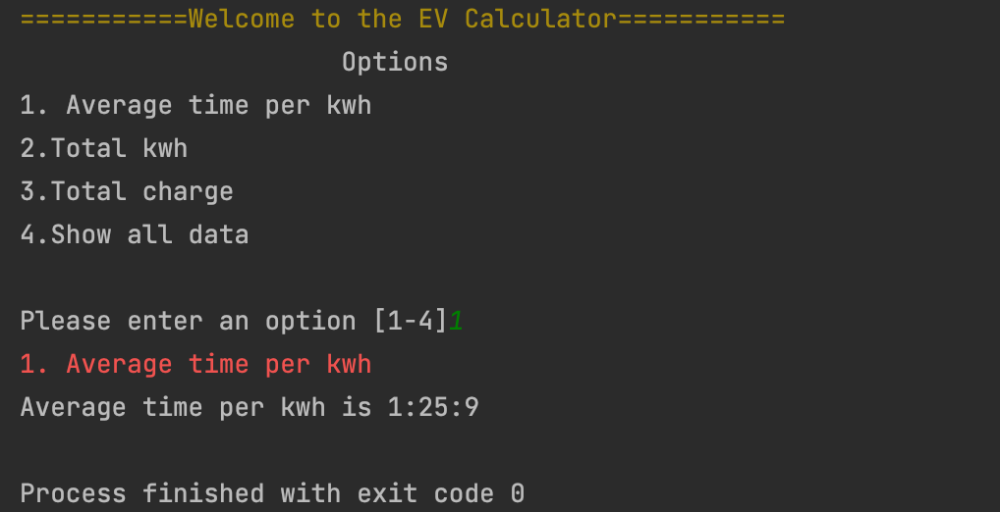
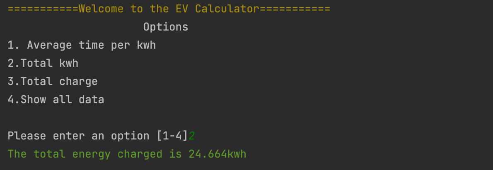
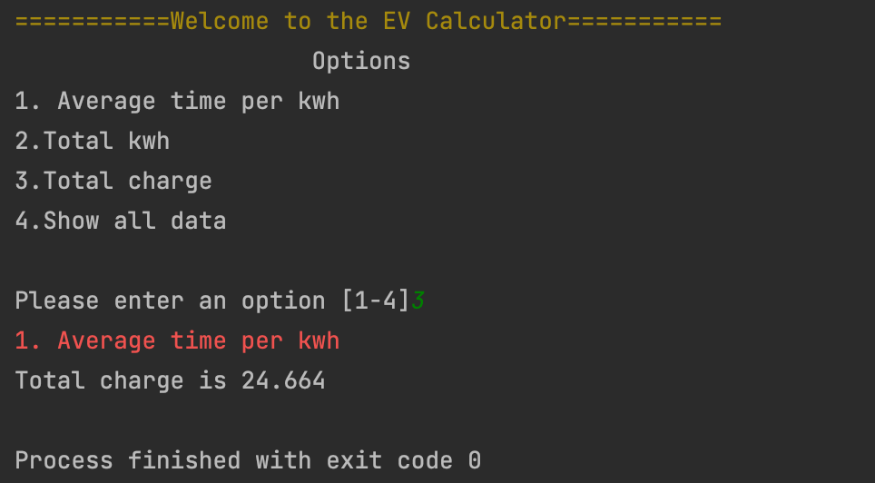
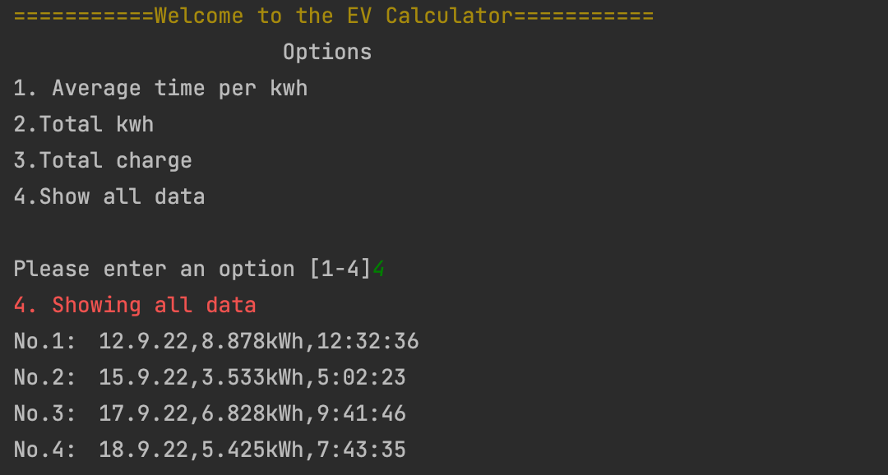

# EV Calculator

## Code
```.py
from my_lib import validate_int_input, colors, end_code

#colors = "\033[;32m"


welcome_msg = "Welcome to the EV Calculator".center(50, "=")
prompt_msg = "Please enter an option [1-4]"
print(f"{colors[3]}{welcome_msg}{end_code}")
print("Options".center(50))

menu = """1. Average time per kwh
2.Total kwh
3.Total charge
4.Show all data
"""

print(menu)
option = validate_int_input(prompt_msg)
while option > 4 or option < 1:
    option = validate_int_input(f"{colors}Invalid option, {prompt_msg}{end_code}")

#option4: show all data
with open("charging_log.csv", "r") as file:
    ev_logs = file.readlines()

if option == 4:
    print(f"{colors[1]}4. Showing all data{end_code}")
    index = 0
    for log in ev_logs:
        if index > 0:
            print(f"No.{index}:　{log}", end="")
        index += 1

if option == 2:
    index = 0
    total_energy = 0
    for log in ev_logs:
        if index > 0:
            values = log.split(",")
            date = values[0]
            energy = values[1]
            time = values[2]
            total_energy += float(energy[0:5])
        index += 1
    print(f"{colors[2]}The total energy charged is {total_energy}kwh")

if option == 1:
    print(f"{colors[1]}1. Average time per kwh {end_code}")
    with open("charging_log.csv","r") as f:
        data = f.readlines()
        i = 0
        total = 0
        lines = 0
        for csv in data:
            if i > 0:
                x = csv.split(",")
                y = x[2]
                z = y.split(":")
                j = int(z[0])*3600 + int(z[1])*60 + int(z[2])
                total += j
                liness = x[1].replace("kWh", "\n")

                lines += float(liness)
            i += 1
        print(lines)
        total_timex = int(total/lines)
        total_time1 = total_timex // 3600
        total_time2 = ((total_timex % 3600) //60)
        total_time3 = ((total_timex % 3600) %60)


        print(f"Average time per kwh is {total_time1}:{total_time2}:{total_time3}")


if option == 3:
    print(f"{colors[1]}1. Average time per kwh {end_code}")
    with open("charging_log.csv","r") as f:
        data = f.readlines()
        i = 0 
        lines = 0
        for csv in data:
            if i > 0:
                x = csv.split(",")
                liness = x[1].replace("kWh", "\n")
                lines += float(liness)
            i += 1

    print(f"Total charge is {lines}")
```

## csv file
```.py
date,charge,duration
12.9.22,8.878kWh,12:32:36
15.9.22,3.533kWh,5:02:23
17.9.22,6.828kWh,9:41:46
18.9.22,5.425kWh,7:43:35
```

## Result




