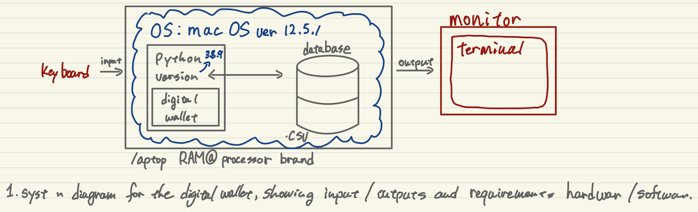
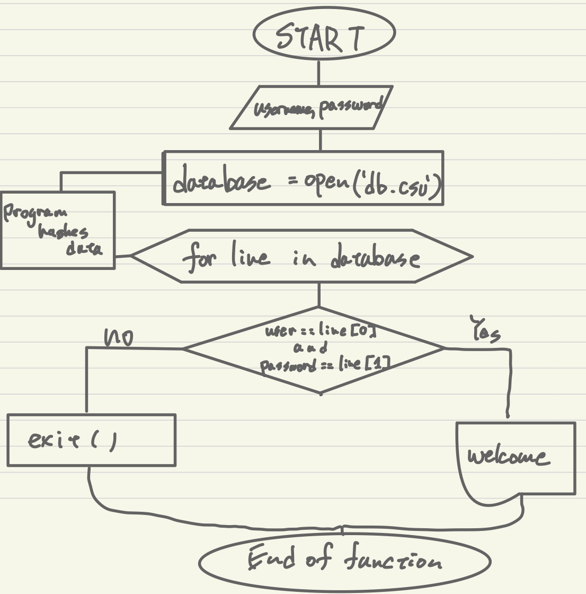
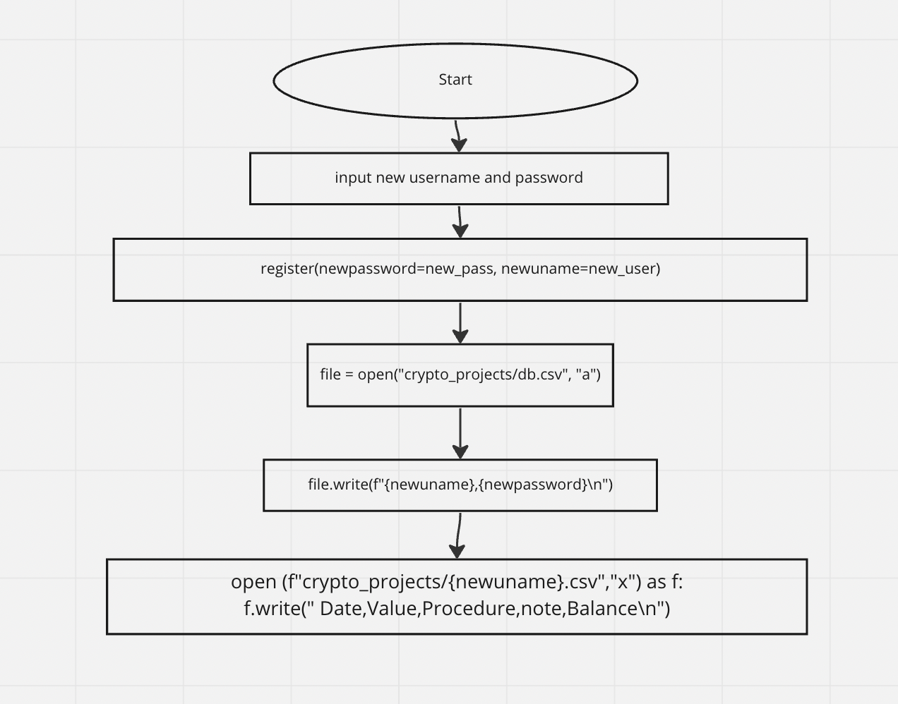
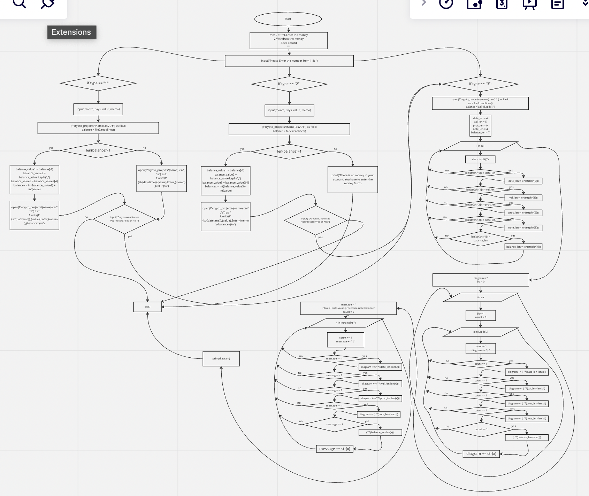

# Cryptowallet

# Criteria A: Planning
## Problem definition
Ms. Sato is a local trader who is interested in the emerging market of cryptocurrencies. She has started to buy and sell electronic currencies, however at the moment she is tracking all his transaction using a ledger in a spreadsheet which is starting to become burdensome and too disorganized. It is also difficult for Ms Sato to find past transactions or important statistics about the currency. Ms Sato is in need of a digital ledger that helps her track the amount of the cryptocurrency, the transactions, along with useful statistics.

Apart for this requirements, Ms Sato is open to explore a cryptocurrency selected by the developer.

## Proposed Solution
Design statement: I will design and make a electronic ledger for a client who is Ms.Sato. The electronic ledger will be about recording the customers' economic activity and is constructed using the software FLOW. It will take couple of weeks to make and will be evaluated according to the criteria below.

** add a description of your coin and citation **

『Flow is a fast, decentralized, developer-friendly blockchain designed as the foundation for a new generation of games, apps, and the digital assets that power them. Flow is the only layer-one blockchain developed independently by the team that has consistently delivered superior blockchain experiences for consumers, including, CryptoKitties, Dapper Wallet, and NBA Top Shot.』 (coinmarketcap.2022)


## Success Criteria
1. The electronic ledger is a text-based software (Runs in the Terminal). 
2. The electronic ledger display the basic description of the cyrptocurrency selected. 
3. The electronic ledger allows to enter, withdraw and record transactions. 
4. The electronic ledger can be opened by only client. 
5. The electronic ledger can make a lot of acounts for a lot of people.
6. The electronic ledger suggests whether you spend too much money or not. 

# Criteria B: Design
## System Diagram

## Flow Diagrams
### Login

### Register

### Activate

## Record of Tasks
Task No	Planned Action	Planned Outcome	Time estimate	Target completion date	Criterion


| Task Number | Planned Actions | Planned Outcome | Time Estimate | Target Completion Date | Criterion |
|-------------|-----------------|-----------------|---------------|------------------------|-----------|
|1            |Create system diagram|To have a clear idea of the hardware and software requirements for the proposed solution|10m|Sep 24|B|
|2            |Create a login function|To ensure that only users can log in.|5h|Sep 27|C|
|3            |Create a register function|To allow multiple users to use this service.|5h|Sep 29|C|
|4            |Create a activate function|To have users make deposits and withdrawals and see their records.|1w|Oct 6|C|
|5            |Make program hashes a data in csv file|To protect the user's personal information.|2h|Oct 6|C|
|6            |Test all the code|To make sure that everything works well.|20m|Oct 7|C|
|7            |Draw Flow Diagram|A flow diagram of the program's functionality must be completed.|20m|Oct 8|C|
|8            |Write the Github|To complete the assignment|3h|Oct 9|C|

# Criteria C: Development
## Login System
my client requires a system to protect the private data. I thought about using a login system to accomplish this requirement using a if condition and the open command to work with a CSV file. more description of the code...

```.py
def login(user:str, password:str)->bool:
    '''
    Fanction for a simple user login needs db.csv
    :param user: string
    :param password: string
    :return: True or False
    '''
    with open("crypto_projects/db.csv") as file:
        database = file.readlines()

    output=False
    for line in database:
        clear_line = line.strip()
        separated_line = clear_line.split(",")
        if user == separated_line[0] and password == separated_line[1]:
            output = True


    return output

```
## Register System

my client requires a system whether the user is a new user or not.  I thought about using a register system to accomplish this requirement using the open command to work with a CSV file.

```.py
def register(newuname:str, newpassword:str):
    '''
    This function saves a user, password in the file
    db.csv
    :param uname: username a string
    :param password: password a string
    :return: nothing
    '''

    #Open the file in mode append:a
    #this means, add to the end of the file

    file = open("crypto_projects/db.csv", "a")
    file.write(f"{newuname},{newpassword}\n")
```

## Activate system
my client requires a system to enter and withdoraw the money, and see the record. I thought about using a activate system to accomplish this requirement.
```.py
def activate(name):
    type = input("Please Enter the number from 1-3: ")

    while (not type == "1" and not type == "2" and not type == "3"):
        type = input("Error.Please Enter the number from 1-3: ")

    while not type.isalnum():
        type = input("Error.Please Enter the number from 1-3: ")


    if type == "1":

        month = input("Month: ")
        while not month.isalnum():
            month = input("Error.Please Enter the Month (eg:10): ")
        while not month.isdigit():
                days = input("Error.Please Enter the Month (eg:10): ")
        while (not month == "1" and not month == "2" and not month == "3" and not month == "4" and not month == "5" and not month == "6" and not month == "7" and not month == "8" and not month == "9" and not month == "10" and not month == "11" and not month == "12"):
            month = input("Error.Please Enter the Month (eg:10): ")
        if month == "1" or month == "3" or month == "5" or month == "7" or month == "8" or month == "10" or month == "12":
            days = input("days: ")
            while not days.isalnum():
                days = input("Error.Please Enter the days (eg:25): ")
            while not days.isdigit():
                days = input("Error.Please Enter the days (eg:25): ")
            while (not days == "1" and not days == "2" and not days == "3" and not days == "4" and not days == "5" and not days == "6" and not days == "7" and not days == "8" and not days == "9" and not days == "10" and not days == "11" and not days == "12" and not days == "13" and not days == "14" and not days == "15" and not days == "16" and not days == "17" and not days == "18" and not days == "19" and not days == "20" and not days == "21" and not days == "22" and not days == "23" and not days == "24" and not days == "25" and not days == "26" and not days == "27" and not days == "28" and not days == "29" and not days == "30" and not days == "31"):
                days = input("Error.Please Enter the days (eg:25): ")
        if month == "4" or month == "6" or month == "9" or month == "11":
            days = input("days: ")
            while not days.isalnum():
                days = input("Error.Please Enter the days (eg:25): ")
            while not days.isdigit():
                days = input("Error.Please Enter the days (eg:25): ")
            while (not days == "1" and not days == "2" and not days == "3" and not days == "4" and not days == "5" and not days == "6" and not days == "7" and not days == "8" and not days == "9" and not days == "10" and not days == "11" and not days == "12" and not days == "13" and not days == "14" and not days == "15" and not days == "16" and not days == "17" and not days == "18" and not days == "19" and not days == "20" and not days == "21" and not days == "22" and not days == "23" and not days == "24" and not days == "25" and not days == "26" and not days == "27" and not days == "28" and not days == "29" and not days == "30"):
                days = input("Error.Please Enter the days (eg:25): ")
        if month == "2":
            days = input("days: ")
            while not days.isalnum():
                days = input("Error.Please Enter the days (eg:25): ")
            while not days.isdigit():
                days = input("Error.Please Enter the days (eg:25): ")
            while (not days == "1" and not days == "2" and not days == "3" and not days == "4" and not days == "5" and not days == "6" and not days == "7" and not days == "8" and not days == "9" and not days == "10" and not days == "11" and not days == "12" and not days == "13" and not days == "14" and not days == "15" and not days == "16" and not days == "17" and not days == "18" and not days == "19" and not days == "20" and not days == "21" and not days == "22" and not days == "23" and not days == "24" and not days == "25" and not days == "26" and not days == "27" and not days == "28" and not days == "29"):
                days = input("Error.Please Enter the days (eg:25): ")


        datetime = (f"{month}/{days}")

        value = input("value:")
        while not value.isalnum():
            value = input("Error.Please Enter the value: ")
        while not value.isdigit():
            value = input("You have to enter the number. Value: ")

        memo = str(input("memo:"))
        while not memo.isalnum():
            memo = input("Error.Please Enter the memo: ")


        with open(f"crypto_projects/{name}.csv","r") as file2:
            balance = file2.readlines()
            if len(balance)>1:
                balance_value1 = balance[-1]
                balance_value2 = balance_value1.split(",")
                balance_value3 = balance_value2[4]
                balancex = int(balance_value3) + int(value)
                with open(f"crypto_projects/{name}.csv","a") as f:
                    f.write(f"{str(datetime)},{value},Enter,{memo},{balancex}\n")
            else:
                with open(f"crypto_projects/{name}.csv","a") as f:
                    f.write(f"{str(datetime)},{value},Enter,{memo},{value}\n")

        type = input("Do you want to see your record? Yes or No: ")
        while not type.isalnum():
            type = input("Error.Please Enter correctly. Yes or No: ")
        if type == "No" or type == "no" or type == "NO":
            print("Thank you!")
            exit()


    if type == "2":

        month = input("Month: ")
        while not month.isalnum():
            month = input("Error.Please Enter the Month (eg:10): ")
        while not month.isdigit():
                days = input("Error.Please Enter the Month (eg:10): ")
        while (not month == "1" and not month == "2" and not month == "3" and not month == "4" and not month == "5" and not month == "6" and not month == "7" and not month == "8" and not month == "9" and not month == "10" and not month == "11" and not month == "12"):
            month = input("Error.Please Enter the Month (eg:10): ")
        if month == "1" or month == "3" or month == "5" or month == "7" or month == "8" or month == "10" or month == "12":
            days = input("days: ")
            while not days.isalnum():
                days = input("Error.Please Enter the days (eg:25): ")
            while not days.isdigit():
                days = input("Error.Please Enter the days (eg:25): ")
            while (not days == "1" and not days == "2" and not days == "3" and not days == "4" and not days == "5" and not days == "6" and not days == "7" and not days == "8" and not days == "9" and not days == "10" and not days == "11" and not days == "12" and not days == "13" and not days == "14" and not days == "15" and not days == "16" and not days == "17" and not days == "18" and not days == "19" and not days == "20" and not days == "21" and not days == "22" and not days == "23" and not days == "24" and not days == "25" and not days == "26" and not days == "27" and not days == "28" and not days == "29" and not days == "30" and not days == "31"):
                days = input("Error.Please Enter the days (eg:25): ")
        if month == "4" or month == "6" or month == "9" or month == "11":
            days = input("days: ")
            while not days.isalnum():
                days = input("Error.Please Enter the days (eg:25): ")
            while not days.isdigit():
                days = input("Error.Please Enter the days (eg:25): ")
            while (not days == "1" and not days == "2" and not days == "3" and not days == "4" and not days == "5" and not days == "6" and not days == "7" and not days == "8" and not days == "9" and not days == "10" and not days == "11" and not days == "12" and not days == "13" and not days == "14" and not days == "15" and not days == "16" and not days == "17" and not days == "18" and not days == "19" and not days == "20" and not days == "21" and not days == "22" and not days == "23" and not days == "24" and not days == "25" and not days == "26" and not days == "27" and not days == "28" and not days == "29" and not days == "30"):
                days = input("Error.Please Enter the days (eg:25): ")
        if month == "2":
            days = input("days: ")
            while not days.isalnum():
                days = input("Error.Please Enter the days (eg:25): ")
            while not days.isdigit():
                days = input("Error.Please Enter the days (eg:25): ")
            while (not days == "1" and not days == "2" and not days == "3" and not days == "4" and not days == "5" and not days == "6" and not days == "7" and not days == "8" and not days == "9" and not days == "10" and not days == "11" and not days == "12" and not days == "13" and not days == "14" and not days == "15" and not days == "16" and not days == "17" and not days == "18" and not days == "19" and not days == "20" and not days == "21" and not days == "22" and not days == "23" and not days == "24" and not days == "25" and not days == "26" and not days == "27" and not days == "28" and not days == "29"):
                days = input("Error.Please Enter the days (eg:25): ")

        datetime = (f"{month}/{days}")

        value = input("value:")
        while not value.isalnum():
            value = input("Error.Please Enter the value: ")
        while not value.isdigit():
            value = input("You have to enter the number. Value: ")

        memo = str(input("memo:"))
        while not memo.isalnum():
            memo = input("Error.Please Enter the memo: ")


        with open(f"crypto_projects/{name}.csv","r") as file2:
            balance = file2.readlines()
            if len(balance)>1:
                balance_value1 = balance[-1]
                balance_value2 = balance_value1.split(",")
                balance_value3 = balance_value2[4]
                balancex = int(balance_value3) - int(value)
                if int(balance_value3) / int(value) > 0.5:
                    ansx = input("you might use money too much. Do you still want to spend this value? Yes or No:")
                    while not ansx.isalnum():
                        ansx = input("Error.Please Enter correctly. Yes or No: ")
                    if ansx == "No" or ansx == "no" or ansx == "NO":
                        print("Good decision!! Thank you!")
                        exit()
                    else:
                        print("OK! Please press enter to go next.")
                        with open(f"crypto_projects/{name}.csv","a") as f:
                            f.write(f"{str(datetime)},{value},Enter,{memo},{balancex}\n")
            else:
                print("There is no money in your account. You have to enter the money fast.")
                exit()

        type = input("Do you want to see your record? Yes or No: ")
        while not type.isalnum():
            type = input("Error.Please Enter correctly. Yes or No: ")
        if type == "No" or type == "no" or type == "NO":
            print("Thank you!")
            exit()


    if type == "3" or type == "yes" or type == "YES" or type == "Yes":

        with open(f"crypto_projects/{name}.csv", 'r') as file3:
            aa = file3.readlines()
            balance = aa[-1].split(",")

        date_len = 4
        val_len = 5
        proc_len = 9
        note_len = 4
        balance_len = 7
        for i in aa:
            chr = i.split(',')
            if len(str(chr[0])) > date_len:
                date_len = len(str(chr[0]))
            if len(str(chr[1])) > val_len:
                val_len = len(str(chr[1]))
            if len(str(chr[2])) > proc_len:
                proc_len = len(str(chr[2]))
            if len(str(chr[3])) > note_len:
                note_len = len(str(chr[3]))
            if len(str(chr[4])) > balance_len:
                balance_len = len(str(chr[4]))

        diagram = ''
        bb = 0
        for i in aa:
            bb+=1
            count = 0
            for x in i.split(','):
                count +=1
                diagram += ' | '
                if count == 1:
                    diagram += (' '*(date_len-len(x)))
                if count == 2:
                    diagram += (' '*(val_len-len(x)))
                if count == 3:
                    diagram += (' '*(proc_len-len(x)))
                if count == 4:
                    diagram += (' '*(note_len-len(x)))
                if count == 5:
                    diagram += (' '*(balance_len-len(x)))
                diagram += str(x)

        message = ''
        intro = '      date,value,procedure,note,balance,'
        count = 0
        for x in intro.split(','):
            count += 1
            message += ' | '
            if count == 1:
                message += (' ' * (date_len - len(x)))
            if count == 2:
                message += (' ' * (val_len - len(x)))
            if count == 3:
                message += (' ' * (proc_len - len(x)))
            if count == 4:
                message += (' ' * (note_len - len(x)))
            if count == 5:
                message += (' ' * (balance_len - len(x)))
            message += str(x)
        print(diagram)

        print("Thank you and See you!!")
```

## Main file(crypto_currency.py)
```.py
from crypto_currency_lib import colors, end_code, login, register, activate

neworold = "Are you a new user? Yes or No: "
ans = input(f"{neworold}")

while (not ans == "Yes" and not ans == "yes" and not ans == "No" and not ans == "no"):
    ans = input("Please answer correctly (Yes or NO): ")

if ans == "Yes" or ans == "yes" or ans == "YES":
    print("You are new user! Please enter your username and password to make a new account.")

    new_user = input("Enter a username: ")
    while not new_user.isalnum():
        new_user = input("Please Enter correctly. Please Enter your username: ")

    new_pass = input("Enter a password: ")
    while not new_pass.isalnum():
        new_pass = input("Please Enter correctly. Please Enter your password: ")

    register(newpassword=new_pass, newuname=new_user)
    uname = new_user

    print("You are registered! Please refresh the page!")
    exit()


elif ans == "No" or ans == "no" or ans == "NO":
    enterpassword = "Please Enter your password: "
    enteruname = "Please Enter your username: "
    uname = input(f"{enteruname}")
    while not uname.isalnum():
        uname = input("Please Enter correctly. Please Enter your username: ")
    upass = input(f"{enterpassword}")

    result = login(user=uname, password=upass)

    while result == False:
        print("Please type your password again.")
        upass = input(f"{enterpassword}")
        result = login(user=uname, password=upass)

    if result == True:
        print("Success to LOGIN!!")


else:
    print("you can't use this system")
    exit()


welcome_msg = "========Welcome to your electronic ledger========".rjust(110, " ")
print(f"{colors[1]}{welcome_msg}{end_code}")
urcrypto = ("Your crypto currency is Flow".rjust(98, " "))
print(f"{colors[3]}{urcrypto}{end_code}")
descrip1 = ("Flow is a fast, decentralized, developer-friendly blockchain designed as the foundation for a new generation of games, apps, and the digital assets that power them.",
            "Flow is the only layer-one blockchain developed independently by the team that has consistently delivered superior blockchain experiences for consumers, including ",
            "CryptoKitties, Dapper Wallet, and NBA Top Shot.")
space=170
print("="*space)
for m in descrip1:
    print(f"{colors[2]}{m.center(space)}{end_code}")
print("="*space)

menu = """1.Enter the money
2.Withdraw the money
3.see record
"""

print(f"{colors[5]}{menu}{end_code}")


activate(name=uname)
```

## library file(crypto_currency.py)
```.py
en("crypto_projects/db.csv") as file:
        database = file.readlines()

    output = False
    for line in database:
        clear_line = line.strip()
        separated_line = clear_line.split(",")
        if user == separated_line[0] and password == separated_line[1]:
            output = True


    return output

def register(newuname:str, newpassword:str):
    '''
    This function saves a user, password in the file
    db.csv
    :param uname: username a string
    :param password: password a string
    :return: nothing
    '''

    #Open the file in mode append:a
    #this means, add to the end of the file

    file = open("crypto_projects/db.csv", "a")
    file.write(f"{newuname},{newpassword}\n")

    with open (f"crypto_projects/{newuname}.csv","x") as f:
        f.write(" Date,Value,Procedure,note,Balance\n")
        pass


def activate(name):
    type = input("Please Enter the number from 1-3: ")

    while (not type == "1" and not type == "2" and not type == "3"):
        type = input("Error.Please Enter the number from 1-3: ")

    while not type.isalnum():
        type = input("Error.Please Enter the number from 1-3: ")


    if type == "1":

        month = input("Month: ")
        while not month.isalnum():
            month = input("Error.Please Enter the Month (eg:10): ")
        while not month.isdigit():
                days = input("Error.Please Enter the Month (eg:10): ")
        while (not month == "1" and not month == "2" and not month == "3" and not month == "4" and not month == "5" and not month == "6" and not month == "7" and not month == "8" and not month == "9" and not month == "10" and not month == "11" and not month == "12"):
            month = input("Error.Please Enter the Month (eg:10): ")
        if month == "1" or month == "3" or month == "5" or month == "7" or month == "8" or month == "10" or month == "12":
            days = input("days: ")
            while not days.isalnum():
                days = input("Error.Please Enter the days (eg:25): ")
            while not days.isdigit():
                days = input("Error.Please Enter the days (eg:25): ")
            while (not days == "1" and not days == "2" and not days == "3" and not days == "4" and not days == "5" and not days == "6" and not days == "7" and not days == "8" and not days == "9" and not days == "10" and not days == "11" and not days == "12" and not days == "13" and not days == "14" and not days == "15" and not days == "16" and not days == "17" and not days == "18" and not days == "19" and not days == "20" and not days == "21" and not days == "22" and not days == "23" and not days == "24" and not days == "25" and not days == "26" and not days == "27" and not days == "28" and not days == "29" and not days == "30" and not days == "31"):
                days = input("Error.Please Enter the days (eg:25): ")
        if month == "4" or month == "6" or month == "9" or month == "11":
            days = input("days: ")
            while not days.isalnum():
                days = input("Error.Please Enter the days (eg:25): ")
            while not days.isdigit():
                days = input("Error.Please Enter the days (eg:25): ")
            while (not days == "1" and not days == "2" and not days == "3" and not days == "4" and not days == "5" and not days == "6" and not days == "7" and not days == "8" and not days == "9" and not days == "10" and not days == "11" and not days == "12" and not days == "13" and not days == "14" and not days == "15" and not days == "16" and not days == "17" and not days == "18" and not days == "19" and not days == "20" and not days == "21" and not days == "22" and not days == "23" and not days == "24" and not days == "25" and not days == "26" and not days == "27" and not days == "28" and not days == "29" and not days == "30"):
                days = input("Error.Please Enter the days (eg:25): ")
        if month == "2":
            days = input("days: ")
            while not days.isalnum():
                days = input("Error.Please Enter the days (eg:25): ")
            while not days.isdigit():
                days = input("Error.Please Enter the days (eg:25): ")
            while (not days == "1" and not days == "2" and not days == "3" and not days == "4" and not days == "5" and not days == "6" and not days == "7" and not days == "8" and not days == "9" and not days == "10" and not days == "11" and not days == "12" and not days == "13" and not days == "14" and not days == "15" and not days == "16" and not days == "17" and not days == "18" and not days == "19" and not days == "20" and not days == "21" and not days == "22" and not days == "23" and not days == "24" and not days == "25" and not days == "26" and not days == "27" and not days == "28" and not days == "29"):
                days = input("Error.Please Enter the days (eg:25): ")


        datetime = (f"{month}/{days}")

        value = input("value:")
        while not value.isalnum():
            value = input("Error.Please Enter the value: ")
        while not value.isdigit():
            value = input("You have to enter the number. Value: ")

        memo = str(input("memo:"))
        while not memo.isalnum():
            memo = input("Error.Please Enter the memo: ")


        with open(f"crypto_projects/{name}.csv","r") as file2:
            balance = file2.readlines()
            if len(balance)>1:
                balance_value1 = balance[-1]
                balance_value2 = balance_value1.split(",")
                balance_value3 = balance_value2[4]
                balancex = int(balance_value3) + int(value)
                with open(f"crypto_projects/{name}.csv","a") as f:
                    f.write(f"{str(datetime)},{value},Enter,{memo},{balancex}\n")
            else:
                with open(f"crypto_projects/{name}.csv","a") as f:
                    f.write(f"{str(datetime)},{value},Enter,{memo},{value}\n")

        type = input("Do you want to see your record? Yes or No: ")
        while not type.isalnum():
            type = input("Error.Please Enter correctly. Yes or No: ")
        if type == "No" or type == "no" or type == "NO":
            print("Thank you!")
            exit()


    if type == "2":

        month = input("Month: ")
        while not month.isalnum():
            month = input("Error.Please Enter the Month (eg:10): ")
        while not month.isdigit():
                days = input("Error.Please Enter the Month (eg:10): ")
        while (not month == "1" and not month == "2" and not month == "3" and not month == "4" and not month == "5" and not month == "6" and not month == "7" and not month == "8" and not month == "9" and not month == "10" and not month == "11" and not month == "12"):
            month = input("Error.Please Enter the Month (eg:10): ")
        if month == "1" or month == "3" or month == "5" or month == "7" or month == "8" or month == "10" or month == "12":
            days = input("days: ")
            while not days.isalnum():
                days = input("Error.Please Enter the days (eg:25): ")
            while not days.isdigit():
                days = input("Error.Please Enter the days (eg:25): ")
            while (not days == "1" and not days == "2" and not days == "3" and not days == "4" and not days == "5" and not days == "6" and not days == "7" and not days == "8" and not days == "9" and not days == "10" and not days == "11" and not days == "12" and not days == "13" and not days == "14" and not days == "15" and not days == "16" and not days == "17" and not days == "18" and not days == "19" and not days == "20" and not days == "21" and not days == "22" and not days == "23" and not days == "24" and not days == "25" and not days == "26" and not days == "27" and not days == "28" and not days == "29" and not days == "30" and not days == "31"):
                days = input("Error.Please Enter the days (eg:25): ")
        if month == "4" or month == "6" or month == "9" or month == "11":
            days = input("days: ")
            while not days.isalnum():
                days = input("Error.Please Enter the days (eg:25): ")
            while not days.isdigit():
                days = input("Error.Please Enter the days (eg:25): ")
            while (not days == "1" and not days == "2" and not days == "3" and not days == "4" and not days == "5" and not days == "6" and not days == "7" and not days == "8" and not days == "9" and not days == "10" and not days == "11" and not days == "12" and not days == "13" and not days == "14" and not days == "15" and not days == "16" and not days == "17" and not days == "18" and not days == "19" and not days == "20" and not days == "21" and not days == "22" and not days == "23" and not days == "24" and not days == "25" and not days == "26" and not days == "27" and not days == "28" and not days == "29" and not days == "30"):
                days = input("Error.Please Enter the days (eg:25): ")
        if month == "2":
            days = input("days: ")
            while not days.isalnum():
                days = input("Error.Please Enter the days (eg:25): ")
            while not days.isdigit():
                days = input("Error.Please Enter the days (eg:25): ")
            while (not days == "1" and not days == "2" and not days == "3" and not days == "4" and not days == "5" and not days == "6" and not days == "7" and not days == "8" and not days == "9" and not days == "10" and not days == "11" and not days == "12" and not days == "13" and not days == "14" and not days == "15" and not days == "16" and not days == "17" and not days == "18" and not days == "19" and not days == "20" and not days == "21" and not days == "22" and not days == "23" and not days == "24" and not days == "25" and not days == "26" and not days == "27" and not days == "28" and not days == "29"):
                days = input("Error.Please Enter the days (eg:25): ")

        datetime = (f"{month}/{days}")

        value = input("value:")
        while not value.isalnum():
            value = input("Error.Please Enter the value: ")
        while not value.isdigit():
            value = input("You have to enter the number. Value: ")

        memo = str(input("memo:"))
        while not memo.isalnum():
            memo = input("Error.Please Enter the memo: ")


        with open(f"crypto_projects/{name}.csv","r") as file2:
            balance = file2.readlines()
            if len(balance)>1:
                balance_value1 = balance[-1]
                balance_value2 = balance_value1.split(",")
                balance_value3 = balance_value2[4]
                balancex = int(balance_value3) - int(value)
                if int(balance_value3) / int(value) > 0.5:
                    ansx = input("you might use money too much. Do you still want to spend this value? Yes or No:")
                    while not ansx.isalnum():
                        ansx = input("Error.Please Enter correctly. Yes or No: ")
                    if ansx == "No" or ansx == "no" or ansx == "NO":
                        print("Good decision!! Thank you!")
                        exit()
                    else:
                        print("OK! Please press enter to go next.")
                        with open(f"crypto_projects/{name}.csv","a") as f:
                            f.write(f"{str(datetime)},{value},Enter,{memo},{balancex}\n")
            else:
                print("There is no money in your account. You have to enter the money fast.")
                exit()

        type = input("Do you want to see your record? Yes or No: ")
        while not type.isalnum():
            type = input("Error.Please Enter correctly. Yes or No: ")
        if type == "No" or type == "no" or type == "NO":
            print("Thank you!")
            exit()


    if type == "3" or type == "yes" or type == "YES" or type == "Yes":

        with open(f"crypto_projects/{name}.csv", 'r') as file3:
            aa = file3.readlines()
            balance = aa[-1].split(",")

        date_len = 4
        val_len = 5
        proc_len = 9
        note_len = 4
        balance_len = 7
        for i in aa:
            chr = i.split(',')
            if len(str(chr[0])) > date_len:
                date_len = len(str(chr[0]))
            if len(str(chr[1])) > val_len:
                val_len = len(str(chr[1]))
            if len(str(chr[2])) > proc_len:
                proc_len = len(str(chr[2]))
            if len(str(chr[3])) > note_len:
                note_len = len(str(chr[3]))
            if len(str(chr[4])) > balance_len:
                balance_len = len(str(chr[4]))

        diagram = ''
        bb = 0
        for i in aa:
            bb+=1
            count = 0
            for x in i.split(','):
                count +=1
                diagram += ' | '
                if count == 1:
                    diagram += (' '*(date_len-len(x)))
                if count == 2:
                    diagram += (' '*(val_len-len(x)))
                if count == 3:
                    diagram += (' '*(proc_len-len(x)))
                if count == 4:
                    diagram += (' '*(note_len-len(x)))
                if count == 5:
                    diagram += (' '*(balance_len-len(x)))
                diagram += str(x)

        message = ''
        intro = '      date,value,procedure,note,balance,'
        count = 0
        for x in intro.split(','):
            count += 1
            message += ' | '
            if count == 1:
                message += (' ' * (date_len - len(x)))
            if count == 2:
                message += (' ' * (val_len - len(x)))
            if count == 3:
                message += (' ' * (proc_len - len(x)))
            if count == 4:
                message += (' ' * (note_len - len(x)))
            if count == 5:
                message += (' ' * (balance_len - len(x)))
            message += str(x)
        print(diagram)

        print("Thank you and See you!!")
```
