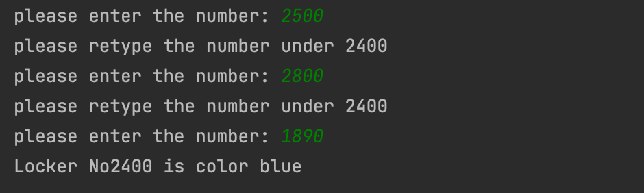

```.py
# task 1 & 2

a = int(input("please enter the number: "))

number_lockers = 2400


while a > 2400:
    print("please retype the number under 2400")
    a = int(input("please enter the number: "))

else:
    for a in range(1, number_lockers+1, 1):
        color_code = a % 4
        if color_code == 0:
            color = "blue"
        if color_code == 1:
            color = "red"
        if color_code == 2:
            color = "white"
        if color_code == 3:
            color = "yellow"

    print(f"Locker No{a} is color {color}")
             
```

